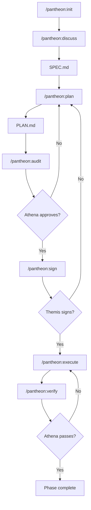
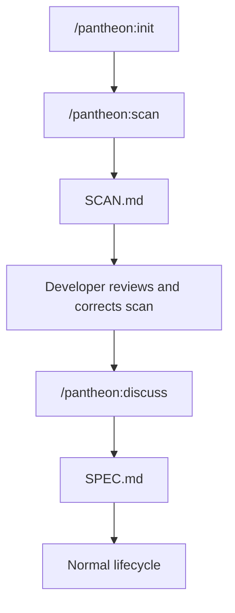

# Pantheon

Read this document in Portuguese: [README.pt-BR.md](README.pt-BR.md).

Pantheon is an open-source, deterministic agentic development framework for Claude Code and Codex. It turns software work into a file-backed lifecycle: discuss the scope, write a specification, generate a plan, audit it, sign the contract, execute tasks, verify the result, and preserve enough state to resume later without losing context.

Pantheon is intentionally lightweight. The framework is made of Markdown instructions, command files, schemas, shell scripts, PowerShell scripts, and a small Node.js metrics helper. It does not require a server, database, or package installation to run its core workflow.

## What Pantheon Solves

Agentic coding sessions often fail for predictable reasons: vague scope, skipped planning, silent drift from requirements, weak verification, and lost context after long sessions. Pantheon addresses those problems by assigning each responsibility to a specialist agent role and by making every phase write its state to files.

Pantheon is useful when you want:

- Spec-first execution instead of ad hoc code generation.
- Explicit approval gates before implementation begins.
- A clean separation between planning, auditing, building, verification, and memory.
- A resumable workflow for long-running development tasks.
- Stronger safeguards around command execution and file modification.
- A repeatable process that works in both Claude Code and Codex.

## Core Principles

- **File-backed state:** Specs, plans, contracts, audits, execution summaries, verification reports, handoffs, and progress logs are written as Markdown files.
- **Strict role boundaries:** Each agent has a narrow authority model. Builders build, auditors audit, sensors run checks, and orchestrators coordinate.
- **No hidden approval:** A plan must pass audit and contract signing before normal execution.
- **Verification before completion:** Work is not considered complete until configured checks have run and the verification report has been judged.
- **Resumability:** Hermes keeps progress and handoff files so another session can continue from the last known state.
- **Self-contained core:** Pantheon avoids third-party runtime dependencies for the framework itself.

## Agent Roles

Pantheon models its workflow as a small council of specialist agents. Zeus is the entry point; the other agents are invoked through the lifecycle.

| Agent | Role | Main Responsibility | Writes |
| --- | --- | --- | --- |
| **Zeus** | Orchestrator | Validates preconditions, drives phase transitions, routes commands to specialist agents, and blocks process violations. | `.pantheon/` state files, lifecycle outputs |
| **Athena** | Auditor and Judge | Audits `PLAN.md` before execution and judges `VERIFY-REPORT.md` after verification. | `AUDIT.md`, judgment section of `VERIFY-REPORT.md` |
| **Themis** | Scope Signer | Compares `SPEC.md` and `PLAN.md`, detects missing requirements or scope drift, and signs the contract only when coverage is exact. | `CONTRACT.md` |
| **Hephaestus** | Builder | Executes approved tasks, edits planned files, runs task checks, records results, and commits completed tasks. | Source changes, `EXECUTION-SUMMARY.md`, task status updates |
| **Hermes** | Messenger and Memory | Tracks progress, creates handoffs, compresses completed phase context, manages checkpoints, and restores session state. | `PROGRESS.md`, `HANDOFF.md`, `.pantheon/memory/*` |
| **Apollo** | Sensor | Runs configured lint, test, typecheck, build, or task verification commands and reports raw results objectively. | Sensor section of `VERIFY-REPORT.md` |

### Zeus

Zeus owns orchestration. Every `/pantheon:*` command starts with Zeus validating the current workspace state and the command preconditions. Zeus does not implement code, run shell commands, approve plans, or judge test output. Its job is to keep the process deterministic and route work to the right agent.

### Athena

Athena has two modes:

- **Audit Mode:** Before execution, Athena checks the generated plan for blockers, major risks, missing acceptance criteria, unsafe file changes, dependency issues, and other rejection conditions.
- **Judge Mode:** After Apollo runs sensors, Athena decides whether the phase passes verification.

Athena cannot edit code or ignore failed sensors. A blocker or major finding rejects the plan or fails verification.

### Themis

Themis is the scope control layer. It maps requirements from `SPEC.md` to tasks in `PLAN.md` and rejects plans that either miss requirements or introduce unapproved work. When the plan exactly matches the specification, Themis writes a signed `CONTRACT.md`.

### Hephaestus

Hephaestus is the implementation agent. It executes tasks sequentially, only touches files declared in the active task, runs task-level verification, and records results. If the same failure repeats three times, Hephaestus triggers the circuit breaker, rolls back the active task, marks it escalated, and stops.

### Hermes

Hermes keeps the workflow recoverable. It writes progress, handoff notes, checkpoints, phase summaries, and long-term lessons. When a session resumes, Hermes reconstructs the current phase, task status, last completed work, and next recommended command from the saved files.

### Apollo

Apollo is the objective verification sensor. It runs only configured commands, captures stdout, stderr, and exit codes, filters noisy terminal output, and writes a structured sensor report. Apollo does not interpret whether the result is acceptable; Athena does that.

## Workflow

Pantheon supports both greenfield and brownfield projects.

### Greenfield Flow

Use this when starting from a new feature or a clear product idea.



### Brownfield Flow

Use this when the project already exists and Pantheon needs to understand the current codebase before planning new work.



The brownfield scan labels findings as:

- `[FOUND]` for evidence directly observed in files.
- `[INFERRED]` for conclusions derived from structure or patterns.

Review `[INFERRED]` items before moving to `/pantheon:discuss`; a wrong scan can contaminate the generated spec.

## Commands

### Lifecycle Commands

| Command | Purpose |
| --- | --- |
| `/pantheon:init` | Initialize `.pantheon/` state and collect basic project configuration. |
| `/pantheon:scan` | Analyze an existing codebase and write `SCAN.md` for brownfield planning. |
| `/pantheon:discuss` | Interview the developer and produce `SPEC.md`. |
| `/pantheon:plan` | Convert `SPEC.md` into an ordered `PLAN.md`. |
| `/pantheon:audit` | Ask Athena to audit the plan before execution. |
| `/pantheon:sign` | Ask Themis to validate scope coverage and write `CONTRACT.md`. |
| `/pantheon:execute` | Ask Hephaestus to implement approved tasks. |
| `/pantheon:verify` | Ask Apollo to run sensors and Athena to judge the result. |
| `/pantheon:status` | Show current phase, task status, and progress. |
| `/pantheon:resume` | Restore context from progress and handoff files. |

### Utility Commands

| Command | Purpose |
| --- | --- |
| `/pantheon:fast` | Run a lighter workflow for small tasks with clear scope. |
| `/pantheon:jump` | Move to a specific checkpoint or lifecycle phase when manual control is needed. |
| `/pantheon:checkpoint` | Save the current workflow state. |
| `/pantheon:learn` | Store lessons, failures, and decisions in Pantheon's memory files. |
| `/pantheon:metrics` | Run the metrics helper and summarize workflow effectiveness. |

### Direct Spawn Commands

Pantheon also includes `/spawn:*` commands for specialist agent prompts:

- `/spawn:zeus`
- `/spawn:athena`
- `/spawn:themis`
- `/spawn:hephaestus`
- `/spawn:hermes`
- `/spawn:apollo`

Normal users should prefer `/pantheon:*` commands. Direct spawn commands are useful for debugging, development, or controlled advanced workflows.

## Installation

Pantheon supports Claude Code and Codex.

### Claude Code Plugin

This repository contains a Claude plugin manifest at:

```text
.claude-plugin/plugin.json
```

It also contains a marketplace manifest at:

```text
.claude-plugin/marketplace.json
```

For a local clone:

```text
/plugin marketplace add /absolute/path/to/Panteon
/plugin install pantheon@pantheon-marketplace
```

For a published GitHub repository:

```text
/plugin marketplace add owner/repo
/plugin install pantheon@pantheon-marketplace
```

Replace `owner/repo` with the actual GitHub repository path after publishing.

### Codex Plugin

This repository contains a Codex plugin manifest at:

```text
.codex-plugin/plugin.json
```

For local development, add Pantheon to a Codex marketplace entry that points to this repository as a local plugin. A marketplace entry should use this shape:

```json
{
  "name": "pantheon",
  "source": {
    "source": "local",
    "path": "./plugins/pantheon"
  },
  "policy": {
    "installation": "AVAILABLE",
    "authentication": "ON_INSTALL"
  },
  "category": "Productivity"
}
```

The plugin root must resolve to this repository, which contains `.codex-plugin/plugin.json` and `skills/`.

### Manual Install

The repository also includes compatibility installers that copy commands and skills into local Claude Code or Codex directories.

Linux or macOS:

```bash
chmod +x install.sh
./install.sh
```

Windows PowerShell:

```powershell
Set-ExecutionPolicy Bypass -Scope Process -Force
.\install.ps1
```

Manual install is useful while plugin support is evolving or when you want direct file copies instead of marketplace installation.

## Repository Structure

```text
.
|-- .claude-plugin/          # Claude Code plugin and marketplace manifests
|-- .codex-plugin/           # Codex plugin manifest
|-- commands/                # Slash command prompts
|   |-- pantheon/            # Main lifecycle commands
|   `-- spawn/               # Direct specialist-agent prompts
|-- docs/                    # Guides, security notes, and planning artifacts
|-- schemas/                 # Markdown templates for workflow outputs
|-- scripts/                 # Utility scripts, including metrics
|-- skills/                  # Agent skill definitions and global rules
|-- install.sh               # POSIX manual installer
|-- install.ps1              # PowerShell manual installer
|-- LICENSE                  # MIT license
`-- README.md
```

## Generated Project Files

When Pantheon is used inside a target project, it creates or updates workflow files such as:

```text
.pantheon/
|-- config.json
|-- PROGRESS.md
|-- HANDOFF.md
|-- SCAN.md
`-- memory/
    `-- LESSONS.md

phases/
`-- <phase-id>/
    |-- SPEC.md
    |-- PLAN.md
    |-- AUDIT.md
    |-- CONTRACT.md
    |-- EXECUTION-SUMMARY.md
    `-- VERIFY-REPORT.md
```

Exact paths may vary by command and project state, but the principle is stable: every important workflow decision should be written to a file.

## Safety Model

Pantheon separates authority by role:

- Zeus coordinates but does not execute shell commands.
- Athena audits and judges but does not modify source code.
- Themis validates scope but does not alter plans or specs.
- Hephaestus builds but is constrained by approved plans and the circuit breaker.
- Apollo runs configured sensors but does not decide pass or fail.
- Hermes manages state but does not implement features.

Global rules live in:

```text
skills/GLOBAL_RULES.md
```

Security guidance lives in:

```text
docs/SECURITY.md
```

## Metrics

Pantheon includes a Node.js metrics helper:

```bash
node scripts/metrics.js
```

Use `/pantheon:metrics` from the agent environment when you want the framework to interpret the results as part of the workflow.

## Development

There is no package installation step for the core framework. Most changes are edits to Markdown command files, Markdown skill files, schemas, or installer scripts.

Recommended checks before submitting changes:

```bash
claude plugin validate .
```

If you have the Codex plugin validator available, validate the Codex manifest as well:

```bash
python3 /path/to/validate_plugin.py /path/to/Panteon
```

Also inspect modified Markdown for broken links, stale command names, and contradictions between `README.md`, `docs/GUIDE.md`, `skills/GLOBAL_RULES.md`, and the plugin manifests.

## Contributing

Contributions are welcome. Keep changes focused and preserve Pantheon's core constraints:

- No unnecessary runtime dependencies.
- Clear file-backed workflow state.
- Strict agent role boundaries.
- Explicit verification before completion claims.
- Security-sensitive command execution rules.

See [CONTRIBUTING.md](CONTRIBUTING.md) for contribution guidelines.

## Security

Do not commit secrets, credentials, private keys, production tokens, or sensitive customer data. Report security concerns privately to the maintainer before opening public issues.

See [docs/SECURITY.md](docs/SECURITY.md) for the current security model.

## License

Pantheon is open source under the [MIT License](LICENSE).
