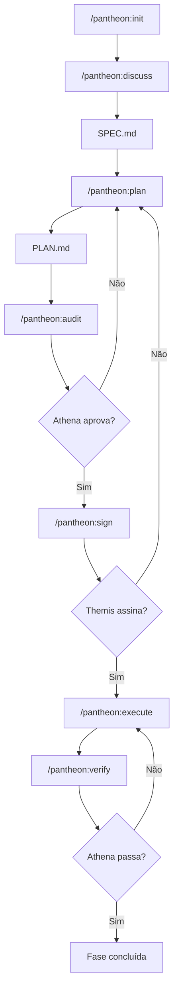
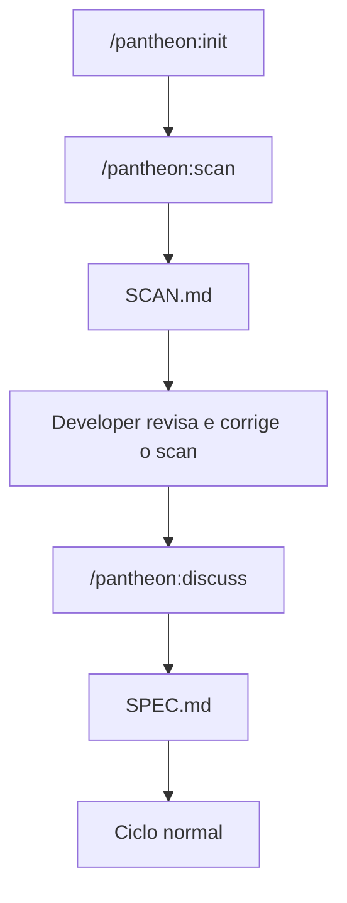

# Pantheon

Leia este documento em inglês: [README.md](README.md).

Pantheon é um framework open source e determinístico de desenvolvimento orientado a agentes para Claude Code e Codex. Ele transforma trabalho de software em um ciclo de vida persistido em arquivos: discutir o escopo, escrever uma especificação, gerar um plano, auditar o plano, assinar o contrato, executar tarefas, verificar o resultado e preservar estado suficiente para retomar depois sem perder contexto.

Pantheon é intencionalmente leve. O framework é composto por instruções Markdown, arquivos de comandos, schemas, scripts shell, scripts PowerShell e um pequeno helper de métricas em Node.js. Ele não exige servidor, banco de dados ou instalação de pacotes para executar o fluxo principal.

## O Que o Pantheon Resolve

Sessões de coding agentic falham por motivos previsíveis: escopo vago, planejamento pulado, desvio silencioso dos requisitos, verificação fraca e perda de contexto após sessões longas. Pantheon reduz esses problemas atribuindo cada responsabilidade a um agente especialista e fazendo cada fase registrar seu estado em arquivos.

Pantheon é útil quando você quer:

- Execução spec-first em vez de geração de código ad hoc.
- Gates explícitos de aprovação antes da implementação.
- Separação clara entre planejamento, auditoria, construção, verificação e memória.
- Um fluxo retomável para tarefas longas de desenvolvimento.
- Salvaguardas mais fortes sobre execução de comandos e modificação de arquivos.
- Um processo repetível que funciona em Claude Code e Codex.

## Princípios Centrais

- **Estado persistido em arquivos:** Specs, planos, contratos, auditorias, sumários de execução, relatórios de verificação, handoffs e logs de progresso são escritos como arquivos Markdown.
- **Limites rígidos de papel:** Cada agente tem um modelo de autoridade estreito. Builders constroem, auditores auditam, sensores rodam checks e orquestradores coordenam.
- **Sem aprovação implícita:** Um plano precisa passar por auditoria e assinatura de contrato antes da execução normal.
- **Verificação antes de conclusão:** O trabalho não é considerado completo até que os checks configurados sejam executados e o relatório de verificação seja julgado.
- **Retomada de contexto:** Hermes mantém progresso e handoffs para outra sessão continuar a partir do último estado conhecido.
- **Core autocontido:** Pantheon evita dependências runtime de terceiros para o próprio framework.

## Papéis dos Agentes

Pantheon modela seu workflow como um pequeno conselho de agentes especialistas. Zeus é o ponto de entrada; os outros agentes são invocados ao longo do ciclo de vida.

| Agente | Papel | Responsabilidade Principal | Escreve |
| --- | --- | --- | --- |
| **Zeus** | Orquestrador | Valida pré-condições, conduz transições de fase, roteia comandos para agentes especialistas e bloqueia violações de processo. | Arquivos de estado em `.pantheon/`, outputs do ciclo |
| **Athena** | Auditora e Juíza | Audita `PLAN.md` antes da execução e julga `VERIFY-REPORT.md` após a verificação. | `AUDIT.md`, seção de julgamento de `VERIFY-REPORT.md` |
| **Themis** | Signatária de Escopo | Compara `SPEC.md` e `PLAN.md`, detecta requisitos ausentes ou desvio de escopo e assina o contrato apenas quando a cobertura é exata. | `CONTRACT.md` |
| **Hephaestus** | Builder | Executa tarefas aprovadas, edita arquivos planejados, roda checks de tarefa, registra resultados e commita tarefas concluídas. | Mudanças de código, `EXECUTION-SUMMARY.md`, atualizações de status |
| **Hermes** | Mensageiro e Memória | Rastreia progresso, cria handoffs, comprime contexto de fases concluídas, gerencia checkpoints e restaura estado da sessão. | `PROGRESS.md`, `HANDOFF.md`, `.pantheon/memory/*` |
| **Apollo** | Sensor | Roda comandos configurados de lint, test, typecheck, build ou verificação de tarefa e reporta resultados objetivos. | Seção de sensores de `VERIFY-REPORT.md` |

### Zeus

Zeus é dono da orquestração. Todo comando `/pantheon:*` começa com Zeus validando o estado atual do workspace e as pré-condições do comando. Zeus não implementa código, não roda comandos shell, não aprova planos e não julga saída de testes. Sua função é manter o processo determinístico e rotear o trabalho para o agente certo.

### Athena

Athena tem dois modos:

- **Audit Mode:** Antes da execução, Athena verifica o plano gerado contra blockers, riscos maiores, critérios de aceite ausentes, mudanças inseguras em arquivos, problemas de dependência e outras condições de rejeição.
- **Judge Mode:** Depois que Apollo roda os sensores, Athena decide se a fase passa na verificação.

Athena não pode editar código nem ignorar sensores falhos. Um finding `BLOCKER` ou `MAJOR` rejeita o plano ou reprova a verificação.

### Themis

Themis é a camada de controle de escopo. Ela mapeia requisitos de `SPEC.md` para tarefas em `PLAN.md` e rejeita planos que deixam requisitos de fora ou introduzem trabalho não aprovado. Quando o plano corresponde exatamente à especificação, Themis escreve um `CONTRACT.md` assinado.

### Hephaestus

Hephaestus é o agente de implementação. Ele executa tarefas em sequência, toca apenas os arquivos declarados na tarefa ativa, roda verificação por tarefa e registra resultados. Se a mesma falha se repetir três vezes, Hephaestus aciona o circuit breaker, reverte a tarefa ativa, marca a tarefa como escalada e para.

### Hermes

Hermes mantém o workflow recuperável. Ele escreve progresso, notas de handoff, checkpoints, resumos de fase e lições de longo prazo. Quando uma sessão é retomada, Hermes reconstrói a fase atual, o status da tarefa, o último trabalho concluído e o próximo comando recomendado a partir dos arquivos salvos.

### Apollo

Apollo é o sensor objetivo de verificação. Ele roda apenas comandos configurados, captura stdout, stderr e exit codes, filtra ruído de terminal e escreve um relatório estruturado de sensores. Apollo não interpreta se o resultado é aceitável; Athena faz isso.

## Workflow

Pantheon suporta projetos greenfield e brownfield.

### Fluxo Greenfield

Use quando estiver começando uma nova feature ou uma ideia de produto clara.



### Fluxo Brownfield

Use quando o projeto já existe e o Pantheon precisa entender o código atual antes de planejar novo trabalho.



O scan brownfield rotula findings como:

- `[FOUND]` para evidências observadas diretamente nos arquivos.
- `[INFERRED]` para conclusões derivadas da estrutura ou de padrões.

Revise itens `[INFERRED]` antes de avançar para `/pantheon:discuss`; um scan incorreto pode contaminar a spec gerada.

## Comandos

### Comandos de Ciclo de Vida

| Comando | Propósito |
| --- | --- |
| `/pantheon:init` | Inicializa o estado em `.pantheon/` e coleta configuração básica do projeto. |
| `/pantheon:scan` | Analisa um codebase existente e escreve `SCAN.md` para planejamento brownfield. |
| `/pantheon:discuss` | Entrevista o desenvolvedor e produz `SPEC.md`. |
| `/pantheon:plan` | Converte `SPEC.md` em um `PLAN.md` ordenado. |
| `/pantheon:audit` | Pede para Athena auditar o plano antes da execução. |
| `/pantheon:sign` | Pede para Themis validar cobertura de escopo e escrever `CONTRACT.md`. |
| `/pantheon:execute` | Pede para Hephaestus implementar tarefas aprovadas. |
| `/pantheon:verify` | Pede para Apollo rodar sensores e para Athena julgar o resultado. |
| `/pantheon:status` | Mostra fase atual, status de tarefas e progresso. |
| `/pantheon:resume` | Restaura contexto a partir dos arquivos de progresso e handoff. |

### Comandos Utilitários

| Comando | Propósito |
| --- | --- |
| `/pantheon:fast` | Roda um fluxo mais leve para tarefas pequenas com escopo claro. |
| `/pantheon:jump` | Move para um checkpoint ou fase específica quando controle manual é necessário. |
| `/pantheon:checkpoint` | Salva o estado atual do workflow. |
| `/pantheon:learn` | Armazena lições, falhas e decisões nos arquivos de memória do Pantheon. |
| `/pantheon:metrics` | Roda o helper de métricas e resume a efetividade do workflow. |

### Comandos Direct Spawn

Pantheon também inclui comandos `/spawn:*` para prompts de agentes especialistas:

- `/spawn:zeus`
- `/spawn:athena`
- `/spawn:themis`
- `/spawn:hephaestus`
- `/spawn:hermes`
- `/spawn:apollo`

Usuários normais devem preferir comandos `/pantheon:*`. Os comandos direct spawn são úteis para debug, desenvolvimento ou workflows avançados controlados.

## Instalação

Pantheon suporta Claude Code e Codex.

### Plugin Claude Code

Este repositório contém um manifesto de plugin Claude em:

```text
.claude-plugin/plugin.json
```

Ele também contém um manifesto de marketplace em:

```text
.claude-plugin/marketplace.json
```

Para um clone local:

```text
/plugin marketplace add /absolute/path/to/Panteon
/plugin install pantheon@pantheon-marketplace
```

Para um repositório publicado no GitHub:

```text
/plugin marketplace add owner/repo
/plugin install pantheon@pantheon-marketplace
```

Substitua `owner/repo` pelo caminho real do repositório no GitHub após a publicação.

### Plugin Codex

Este repositório contém um manifesto de plugin Codex em:

```text
.codex-plugin/plugin.json
```

Para desenvolvimento local, adicione Pantheon a uma entrada de marketplace do Codex que aponte para este repositório como plugin local. Uma entrada de marketplace deve usar este formato:

```json
{
  "name": "pantheon",
  "source": {
    "source": "local",
    "path": "./plugins/pantheon"
  },
  "policy": {
    "installation": "AVAILABLE",
    "authentication": "ON_INSTALL"
  },
  "category": "Productivity"
}
```

A raiz do plugin precisa resolver para este repositório, que contém `.codex-plugin/plugin.json` e `skills/`.

### Instalação Manual

O repositório também inclui instaladores de compatibilidade que copiam comandos e skills para diretórios locais do Claude Code ou Codex.

Linux ou macOS:

```bash
chmod +x install.sh
./install.sh
```

Windows PowerShell:

```powershell
Set-ExecutionPolicy Bypass -Scope Process -Force
.\install.ps1
```

A instalação manual é útil enquanto o suporte a plugins evolui ou quando você quer cópias diretas de arquivos em vez de instalação via marketplace.

## Estrutura do Repositório

```text
.
|-- .claude-plugin/          # Manifestos do plugin e marketplace Claude Code
|-- .codex-plugin/           # Manifesto do plugin Codex
|-- commands/                # Prompts de slash commands
|   |-- pantheon/            # Comandos principais de ciclo de vida
|   `-- spawn/               # Prompts diretos de agentes especialistas
|-- docs/                    # Guias, notas de segurança e artefatos de planejamento
|-- schemas/                 # Templates Markdown para outputs do workflow
|-- scripts/                 # Scripts utilitários, incluindo métricas
|-- skills/                  # Definições de skills dos agentes e regras globais
|-- install.sh               # Instalador manual POSIX
|-- install.ps1              # Instalador manual PowerShell
|-- LICENSE                  # Licença MIT
`-- README.md
```

## Arquivos Gerados no Projeto

Quando Pantheon é usado dentro de um projeto alvo, ele cria ou atualiza arquivos de workflow como:

```text
.pantheon/
|-- config.json
|-- PROGRESS.md
|-- HANDOFF.md
|-- SCAN.md
`-- memory/
    `-- LESSONS.md

phases/
`-- <phase-id>/
    |-- SPEC.md
    |-- PLAN.md
    |-- AUDIT.md
    |-- CONTRACT.md
    |-- EXECUTION-SUMMARY.md
    `-- VERIFY-REPORT.md
```

Os caminhos exatos podem variar por comando e estado do projeto, mas o princípio é estável: toda decisão importante do workflow deve ser escrita em arquivo.

## Modelo de Segurança

Pantheon separa autoridade por papel:

- Zeus coordena, mas não executa comandos shell.
- Athena audita e julga, mas não modifica código-fonte.
- Themis valida escopo, mas não altera planos ou specs.
- Hephaestus constrói, mas é limitado por planos aprovados e pelo circuit breaker.
- Apollo roda sensores configurados, mas não decide pass ou fail.
- Hermes gerencia estado, mas não implementa features.

As regras globais ficam em:

```text
skills/GLOBAL_RULES.md
```

As diretrizes de segurança ficam em:

```text
docs/SECURITY.md
```

## Métricas

Pantheon inclui um helper de métricas em Node.js:

```bash
node scripts/metrics.js
```

Use `/pantheon:metrics` no ambiente do agente quando quiser que o framework interprete os resultados como parte do workflow.

## Desenvolvimento

Não há etapa de instalação de pacotes para o core do framework. A maior parte das mudanças são edições em arquivos Markdown de comandos, arquivos Markdown de skills, schemas ou scripts de instalação.

Checks recomendados antes de enviar mudanças:

```bash
claude plugin validate .
```

Se você tiver o validador de plugin Codex disponível, valide também o manifesto Codex:

```bash
python3 /path/to/validate_plugin.py /path/to/Panteon
```

Também revise Markdown modificado para links quebrados, nomes de comandos desatualizados e contradições entre `README.md`, `README.pt-BR.md`, `docs/GUIDE.md`, `skills/GLOBAL_RULES.md` e os manifestos de plugin.

## Contribuição

Contribuições são bem-vindas. Mantenha mudanças focadas e preserve as restrições centrais do Pantheon:

- Sem dependências runtime desnecessárias.
- Estado de workflow claro e persistido em arquivos.
- Limites rígidos de papel entre agentes.
- Verificação explícita antes de alegar conclusão.
- Regras sensíveis de segurança para execução de comandos.

Veja [CONTRIBUTING.md](CONTRIBUTING.md) para diretrizes de contribuição.

## Segurança

Não commite secrets, credenciais, chaves privadas, tokens de produção ou dados sensíveis de clientes. Reporte preocupações de segurança de forma privada ao maintainer antes de abrir issues públicas.

Veja [docs/SECURITY.md](docs/SECURITY.md) para o modelo de segurança atual.

## Licença

Pantheon é open source sob a [Licença MIT](LICENSE).
