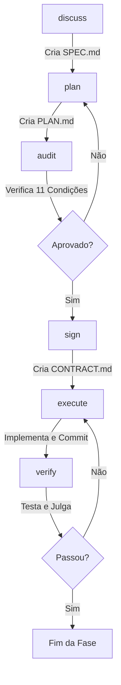
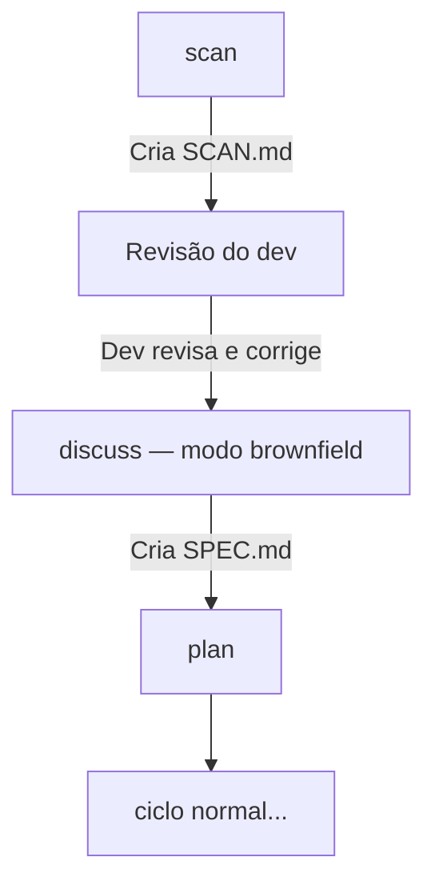

# Guia de Execução - Pantheon Framework 🏛️

Este guia detalha o fluxo completo de utilização do Pantheon para gerenciar o ciclo de vida do desenvolvimento.

## 🛠️ 1. Instalação e Configuração

O Pantheon foi projetado para integrar-se ao Claude Code ou Codex. Ele copia comandos personalizados para o diretório de configuração do runtime do agente.

### Windows (PowerShell)
Execute no terminal do workspace do projeto:
```powershell
.\install.ps1
```

### Linux / macOS
Execute no terminal:
```bash
chmod +x install.sh
./install.sh
```

---

## 🔄 2. O Ciclo de Desenvolvimento Completo

O ciclo de vida no Pantheon é rígido e segue uma sequência obrigatória de comandos:



### Passo 1: Especificação `/pantheon:discuss`
Este comando inicia a conversa interativa. Responda às perguntas sobre stack de tecnologia, diretrizes de código, regras de negócio e limites de escopo. Ao final, o arquivo `SPEC.md` é salvo no workspace.

### Passo 2: Planejamento `/pantheon:plan`
Zeus analisa o `SPEC.md` e gera as tarefas necessárias listadas em `phases/XX/PLAN.md`. O status inicial do plano é `PENDING_AUDIT`.

### Passo 3: Auditoria `/pantheon:audit`
Invoca Atena para validar a conformidade técnica e de segurança do plano. Se Atena aprovar (sem blockers/major issues), ela escreve `AUDIT.md` e o plano muda para `APPROVED`.

### Passo 4: Assinatura de Contrato `/pantheon:sign`
Themis entra em ação para garantir que o plano cobre exatamente o que foi especificado (nem mais, nem menos). Se o escopo estiver alinhado, ela gera e assina `CONTRACT.md` (`SIGNED`), autorizando Hefesto a construir.

### Passo 5: Construção e Implementação `/pantheon:execute`
Hefesto implementa as tarefas sequencialmente. Para cada tarefa:
1. Faz as alterações necessárias no código.
2. Roda a verificação de tarefa.
3. Se passar, faz o commit `[TaskID] Descrição` e atualiza o `EXECUTION-SUMMARY.md`.
4. Se falhar, tenta corrigir em até 3 retries (circuit breaker). Se atingir o limite, executa rollback e entra no estado `ESCALATED`.

### Passo 6: Verificação Final de Fase `/pantheon:verify`
Apolo executa os sensores globais definidos no `config.json` e monta o relatório. Atena julga se o projeto está pronto. Se aprovado (`PASS`), Hermes consolida a fase em `PROGRESS.md`. Se falhar, você deve retornar à execução.

---

## 🏗️ 3. Projetos Brownfield (Já Iniciados)

Se o projeto já existe e você quer entrar no ciclo spec-driven a partir do estado atual, use o fluxo brownfield:



### Passo 0: Scan `/pantheon:scan`
Zeus analisa o projeto existente e gera `.pantheon/SCAN.md` com três blocos:
- **Identidade técnica:** stack, dependências, comandos de qualidade.
- **Mapa de entregáveis:** estrutura de diretórios, módulos identificados, padrão arquitetural.
- **Diagnóstico de dívida técnica:** itens `[RISK]`, `[GAP]` e `[INCONSISTENCY]`.

Cada item carrega `[FOUND]` (evidência direta) ou `[INFERRED]` (derivado de padrões).

> ⚠️ **Atenção aos itens `[INFERRED]`:** eles são derivados por Zeus a partir de padrões observados no código, não de evidências diretas. Revise-os com cuidado antes de prosseguir — um `[INFERRED]` incorreto pode contaminar a `SPEC.md` inteira. Corrija no `SCAN.md` antes de rodar `/pantheon:discuss`.

### Passo 1 (adaptado): Especificação `/pantheon:discuss`
Com `SCAN.md` presente, Zeus detecta automaticamente o contexto brownfield. Antes de iniciar, Zeus perguntará se você já revisou e corrigiu o `SCAN.md` — responda `n` se ainda não fez isso. Se confirmado, em vez de uma entrevista do zero, apresenta o que já foi mapeado e faz apenas as perguntas que o scan não conseguiu responder: objetivo da fase, regras de negócio específicas, princípios inegociáveis, fora de escopo.

O output continua sendo o mesmo `SPEC.md`. A partir daí, o ciclo é idêntico ao greenfield.

---

## ❓ FAQ (Perguntas Frequentes)

### O que fazer se a verificação de uma tarefa falhar consecutivamente?
Se falhar 3 vezes consecutivas, Hefesto cancelará a execução atual, fará o rollback dos arquivos alterados no commit atual e alterará o status da fase para `ESCALATED`. Você deverá revisar os logs no terminal, corrigir o problema subjacente ou ajustar o plano, auditando-o novamente.

### Como continuar o trabalho após uma pausa?
Use o comando `/pantheon:resume` para que Hermes leia o log de progresso e as notas de handoff e apresente exatamente onde a execução parou.

### Comandos Dinâmicos
O Pantheon também suporta um fluxo mais dinâmico:
*   Use `/pantheon:fast <tarefa>` para pular planejamento burocrático em tarefas pequenas.
*   Use `/pantheon:jump <alvo>` para avançar ou recuar livremente, acompanhado de `/pantheon:checkpoint` para salvar estados.
*   Use `/pantheon:learn` para consolidar conhecimentos em `.pantheon/memory/LESSONS.md`.
*   Use `/pantheon:metrics` para analisar a eficácia da IA usando nosso script Node.js nativo.
