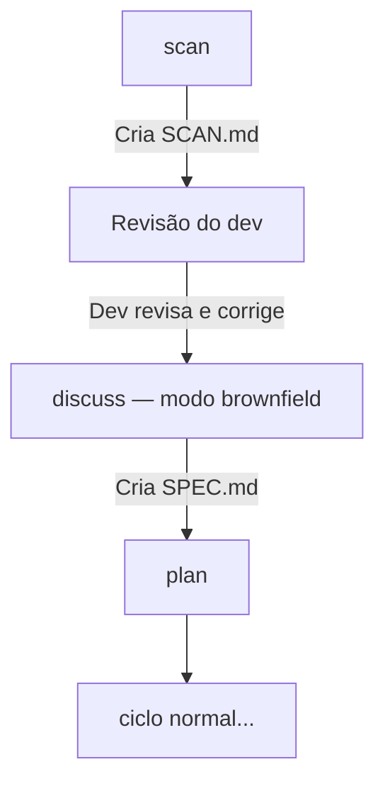

# Brownfield Scan Implementation Plan

> **For agentic workers:** REQUIRED SUB-SKILL: Use superpowers:subagent-driven-development (recommended) or superpowers:executing-plans to implement this plan task-by-task. Steps use checkbox (`- [ ]`) syntax for tracking.

**Goal:** Add `/pantheon:scan` command that maps an existing project and enables brownfield spec-driven development via auto-adapted `/pantheon:discuss`.

**Architecture:** New `scan.md` command file + new `SCAN.template.md` schema define the scan behavior. Minimal surgery on `discuss.md` adds brownfield detection. Zeus SKILL.md gains the new precondition entry and protocol section. No other pipeline files change.

**Tech Stack:** Markdown instruction files for AI agents (Claude Code / Codex). No runtime code — verification is structural consistency and pattern compliance.

---

## File Map

| Action   | File                                | Responsibility                                              |
|----------|-------------------------------------|-------------------------------------------------------------|
| Create   | `schemas/SCAN.template.md`          | Reference template Zeus fills when writing `.pantheon/SCAN.md` |
| Create   | `commands/pantheon/scan.md`         | Full command spec: preconditions, execution sequence, output |
| Modify   | `commands/pantheon/discuss.md`      | Add brownfield detection + adapted interview behavior        |
| Modify   | `skills/zeus/SKILL.md`              | Add scan precondition row + scan protocol in Section 5       |
| Modify   | `docs/GUIDE.md`                     | Document brownfield flow alongside existing greenfield cycle |

---

## Task 1: Create `schemas/SCAN.template.md`

**Files:**
- Create: `schemas/SCAN.template.md`

- [ ] **Step 1: Write the template file**

Create `schemas/SCAN.template.md` with this exact content:

```markdown
# SCAN - [Project Name]

> Generated by `/pantheon:scan` on [DATE]. Review before running `/pantheon:discuss`.
> Legend: [FOUND] = direct evidence in files | [INFERRED] = derived from patterns

---

## Block 1 — Technical Identity

### Runtime
- Language: [e.g. TypeScript / Python 3.11 / Go 1.22] [FOUND|INFERRED]
- Runtime: [e.g. Node.js 20 / CPython / native binary] [FOUND|INFERRED]
- Package manager: [e.g. npm / pnpm / poetry / go modules] [FOUND]

### Key Dependencies
| Package | Version | Role | Source |
|---------|---------|------|--------|
| [name]  | [ver]   | [role] | [FOUND\|INFERRED] |

### Quality Gate Commands
| Sensor     | Command                        | Source       |
|------------|--------------------------------|--------------|
| lint       | [command or `none detected`]   | [FOUND\|INFERRED] |
| typecheck  | [command or `none detected`]   | [FOUND\|INFERRED] |
| test       | [command or `none detected`]   | [FOUND\|INFERRED] |
| build      | [command or `none detected`]   | [FOUND\|INFERRED] |

---

## Block 2 — Deliverables Map

### Directory Structure
```
[project-root]/
├── [dir/]      → [inferred purpose]
├── [dir/]      → [inferred purpose]
└── [file]      → [inferred purpose]
```

### Identified Modules / Domains
| Module | Path | Pattern | Completeness | Source |
|--------|------|---------|--------------|--------|
| [name] | [path] | [e.g. layered / MVC / event-driven] | [e.g. partial / complete] | [FOUND\|INFERRED] |

### Architectural Pattern
[e.g. Layered (controller → service → repository), Event-driven with BullMQ workers, etc.] [FOUND|INFERRED]

---

## Block 3 — Technical Debt Diagnosis

### [RISK] — High-impact issues that may affect implementation
- [ ] [Description. File: `path/to/file.ts:line`] [FOUND|INFERRED]

### [GAP] — Missing elements expected for the detected stack
- [ ] [Description. Expected: `path/to/missing`. Detected pattern: `X`] [FOUND|INFERRED]

### [INCONSISTENCY] — Internal contradictions or broken patterns
- [ ] [Description. File A: `path` does X. File B: `path` does Y.] [FOUND|INFERRED]

---

## Scan Summary

- Modules mapped: [N]
- [RISK] items: [N]
- [GAP] items: [N]
- [INCONSISTENCY] items: [N]

**Next step:** Review this file, then run `/pantheon:discuss`.
```

- [ ] **Step 2: Verify structure**

```bash
grep -c "\[FOUND\|INFERRED\]" /home/$(whoami)/Documentos/Projetos/Panteon/schemas/SCAN.template.md
```

Expected output: number greater than 0 (confirms legend markers are present).

```bash
grep "Block 1\|Block 2\|Block 3" /home/$(whoami)/Documentos/Projetos/Panteon/schemas/SCAN.template.md
```

Expected output: three lines, one per block.

- [ ] **Step 3: Commit**

```bash
git add schemas/SCAN.template.md
git commit -m "feat(schema): add SCAN.template.md for brownfield project mapping"
```

---

## Task 2: Create `commands/pantheon/scan.md`

**Files:**
- Create: `commands/pantheon/scan.md`

- [ ] **Step 1: Write the command file**

Create `commands/pantheon/scan.md` with this exact content:

```markdown
# Command: /pantheon:scan

## 1. Overview
* **Description:** Analyzes an existing project and produces a structured `SCAN.md` mapping the technical identity, deliverables, and technical debt. The output feeds `/pantheon:discuss` in brownfield mode.
* **Responsible Agent:** Zeus
* **Runtimes Target:** Claude Code, Codex

## 2. Pre-conditions
* `.pantheon/config.json` must exist (workspace initialized via `/pantheon:init`).
* If `.pantheon/SCAN.md` already exists, Zeus must warn the developer and ask for confirmation before overwriting.

## 3. Inputs
* Project source files (read-only): manifests, configs, directory structure, code samples.

## 4. Execution Sequence

### Step 1 — Precondition check
1. Check if `.pantheon/config.json` exists.
   - If not: abort with `[ZEUS-BLOCKED]`:
     ```
     [ZEUS-BLOCKED] Command: `/pantheon:scan`
     Reason: Workspace not initialized.
     Required: `.pantheon/config.json` must exist.
     Action: Run `/pantheon:init` first.
     ```
2. Check if `.pantheon/SCAN.md` already exists.
   - If yes: warn developer — `"SCAN.md already exists. Overwrite? (y/n)"` — abort if no.

### Step 2 — Evidence collection (read-only, no file modifications)
Zeus reads the following, in order:

| Source | Files / Paths |
|--------|---------------|
| Dependency manifests | `package.json`, `pyproject.toml`, `requirements.txt`, `go.mod`, `Cargo.toml` |
| Script definitions | `package.json#scripts`, `Makefile`, `Taskfile.yml`, `.github/workflows/*.yml` |
| Config files | `tsconfig.json`, `.eslintrc*`, `jest.config.*`, `vitest.config.*`, `pylintrc`, `.flake8` |
| Directory structure | Project root, up to 3 levels deep (exclude `node_modules/`, `.git/`, `dist/`, `build/`) |
| Code samples | One representative file per identified module — sufficient for pattern inference only |

### Step 3 — Analysis and inference
Zeus synthesizes the three blocks defined in `schemas/SCAN.template.md`:

- **Block 1 (Technical Identity):** Extract runtime, package manager, dependencies, and quality gate commands.
- **Block 2 (Deliverables Map):** Map directory structure with inferred purpose per module. Identify architectural patterns.
- **Block 3 (Technical Debt Diagnosis):** Flag inconsistencies, gaps, and risks. Tag each as `[RISK]`, `[GAP]`, or `[INCONSISTENCY]`.

**Labeling rule:** Every item in SCAN.md must carry either `[FOUND]` (direct evidence) or `[INFERRED]` (derived from patterns). Zeus must never omit this label.

### Step 4 — Write and confirm
1. Write `.pantheon/SCAN.md` following `schemas/SCAN.template.md`.
2. Print terminal summary:

```
[ZEUS] Scan complete.

Mapped:
  runtime     → <detected runtime>
  modules     → <N> identified
  signals     → <N> [RISK], <N> [GAP], <N> [INCONSISTENCY]

Review .pantheon/SCAN.md, then run /pantheon:discuss.
```

## 5. Outputs
* **`.pantheon/SCAN.md`**: Structured project map with technical identity, deliverables, and technical debt diagnosis.
```

- [ ] **Step 2: Verify structure matches existing command pattern**

```bash
grep "## 1. Overview\|## 2. Pre-conditions\|## 3. Inputs\|## 4. Execution Sequence\|## 5. Outputs" \
  /home/$(whoami)/Documentos/Projetos/Panteon/commands/pantheon/scan.md
```

Expected: 5 lines (one per section header).

```bash
grep "ZEUS-BLOCKED\|config.json\|SCAN.md" \
  /home/$(whoami)/Documentos/Projetos/Panteon/commands/pantheon/scan.md | wc -l
```

Expected: number greater than 3 (confirms precondition checks and output reference are present).

- [ ] **Step 3: Commit**

```bash
git add commands/pantheon/scan.md
git commit -m "feat(command): add /pantheon:scan brownfield project mapping command"
```

---

## Task 3: Modify `commands/pantheon/discuss.md`

**Files:**
- Modify: `commands/pantheon/discuss.md`

- [ ] **Step 1: Read the current file to confirm baseline**

```bash
cat /home/$(whoami)/Documentos/Projetos/Panteon/commands/pantheon/discuss.md
```

Expected: 25-line file with sections 1–5, no brownfield logic.

- [ ] **Step 2: Replace the file with brownfield-aware version**

Replace `commands/pantheon/discuss.md` with this exact content:

```markdown
# Command: /pantheon:discuss

## 1. Overview
* **Description:** Initiates an interactive conversation between the developer and Zeus (the Orchestrator) to detail the system requirements, stack, linting sensors, and specific business rules. Supports brownfield mode when `.pantheon/SCAN.md` exists.
* **Responsible Agent:** Zeus
* **Runtimes Target:** Claude Code, Codex

## 2. Pre-conditions
* `.pantheon/config.json` must exist (workspace initialized via `/pantheon:init`).

## 3. Inputs
* Developer prompts and instructions.
* References to any initial designs or documents.
* `.pantheon/SCAN.md` (optional — triggers brownfield mode if present).

## 4. Execution Sequence

### Brownfield detection (runs before interview)
Zeus checks if `.pantheon/SCAN.md` exists.
- **If yes:** Enter brownfield mode (see Section 4B).
- **If no:** Enter greenfield mode (see Section 4A).

---

### 4A — Greenfield mode (no SCAN.md)
1. **Zeus Interview:** Zeus asks structured questions about:
   - Target stack and architectures.
   - Quality gates (compilation, linter, test runner).
   - Core functional requirements and files.
2. **Spec Drafting:** Zeus aggregates the inputs and writes them into a unified specification file.
3. **Validation:** Zeus ensures all fields required by the spec template are populated.

---

### 4B — Brownfield mode (SCAN.md present)
1. **Context load:** Zeus reads `.pantheon/SCAN.md` and opens the session with a summary:

   ```
   SCAN.md found. Brownfield context loaded.

   Auto-mapped:
     stack       → <Block 1: runtime>
     lint        → <Block 1: lint command or "none detected">
     test        → <Block 1: test command or "none detected">
     modules     → <Block 2: module list> (<N> total)
     signals     → <N> [RISK], <N> [GAP], <N> [INCONSISTENCY]

   I'll confirm critical points and fill in what the scan couldn't answer.
   ```

2. **Targeted interview:** Zeus asks **only** the questions the scan could not answer with confidence:
   - Phase objective (what is being built or changed in this phase).
   - Specific business rules not derivable from code.
   - Non-negotiable principles (e.g., zero external dependencies, idempotency requirements).
   - Explicit out-of-scope boundaries.
   - Confirmation or correction of any `[INFERRED]` items Zeus is unsure about.

   Zeus does **not** re-ask about stack, dependencies, or sensor commands — these are already answered by SCAN.md.

3. **Spec Drafting:** Zeus merges SCAN.md context with developer answers and writes `SPEC.md`.
4. **Validation:** Zeus ensures all fields required by the spec template are populated.

## 5. Outputs
* **`SPEC.md`**: The official, complete specification document for the phase.
```

- [ ] **Step 3: Verify brownfield detection section exists**

```bash
grep "Brownfield detection\|4A\|4B\|SCAN.md found" \
  /home/$(whoami)/Documentos/Projetos/Panteon/commands/pantheon/discuss.md
```

Expected: 4 matching lines.

```bash
grep "4A — Greenfield\|4B — Brownfield" \
  /home/$(whoami)/Documentos/Projetos/Panteon/commands/pantheon/discuss.md
```

Expected: 2 lines.

- [ ] **Step 4: Commit**

```bash
git add commands/pantheon/discuss.md
git commit -m "feat(command): add brownfield mode to /pantheon:discuss via SCAN.md detection"
```

---

## Task 4: Modify `skills/zeus/SKILL.md`

**Files:**
- Modify: `skills/zeus/SKILL.md`

Two changes: (a) add `/pantheon:scan` row to the precondition table in Section 4, (b) add scan protocol in Section 5.

- [ ] **Step 1: Add precondition row to Section 4 table**

In `skills/zeus/SKILL.md`, find the precondition table. Add this row after the `/pantheon:init` row:

```markdown
| `/pantheon:scan` | `.pantheon/config.json` must exist (workspace initialized). If `.pantheon/SCAN.md` already exists, developer must confirm overwrite. |
```

- [ ] **Step 2: Add scan protocol to Section 5**

In Section 5 (`## 5. Command Protocols`), after the `/pantheon:discuss` block, add:

```markdown
### `/pantheon:scan`
1. Check preconditions: `.pantheon/config.json` must exist. If `SCAN.md` exists, ask developer to confirm overwrite.
2. Collect evidence (read-only): dependency manifests, script definitions, config files, directory structure (3 levels), code samples (one file per module).
3. Analyze and synthesize three blocks: Technical Identity, Deliverables Map, Technical Debt Diagnosis.
4. Label every finding as `[FOUND]` (direct evidence) or `[INFERRED]` (derived) — never omit labels.
5. Write `.pantheon/SCAN.md` following `schemas/SCAN.template.md`.
6. Print summary: runtime detected, N modules mapped, N [RISK]/[GAP]/[INCONSISTENCY] signals.
7. Confirm: "Review `.pantheon/SCAN.md`, then run `/pantheon:discuss`."
```

- [ ] **Step 3: Add `/pantheon:scan` to discuss precondition (brownfield)**

In Section 4, find the `/pantheon:discuss` precondition row and update it to:

```markdown
| `/pantheon:discuss` | `.pantheon/config.json` must exist (init was completed). If `.pantheon/SCAN.md` exists, brownfield mode is activated automatically. |
```

- [ ] **Step 4: Verify consistency**

```bash
grep "/pantheon:scan" /home/$(whoami)/Documentos/Projetos/Panteon/skills/zeus/SKILL.md
```

Expected: at least 2 lines (precondition table row + protocol section).

```bash
grep "FOUND\|INFERRED\|SCAN.md" /home/$(whoami)/Documentos/Projetos/Panteon/skills/zeus/SKILL.md | wc -l
```

Expected: number greater than 3.

- [ ] **Step 5: Commit**

```bash
git add skills/zeus/SKILL.md
git commit -m "feat(zeus): add /pantheon:scan precondition and protocol to Zeus SKILL.md"
```

---

## Task 5: Update `docs/GUIDE.md`

**Files:**
- Modify: `docs/GUIDE.md`

- [ ] **Step 1: Add brownfield section to the guide**

In `docs/GUIDE.md`, after the existing cycle diagram and before the FAQ section, add:

```markdown
---

## 🏗️ 3. Brownfield Projects (Projetos Já Iniciados)

Se o projeto já existe e você quer entrar no ciclo spec-driven a partir do estado atual, use o fluxo brownfield:



### Passo 0: Scan `/pantheon:scan`
Zeus analisa o projeto existente e gera `.pantheon/SCAN.md` com três blocos:
- **Identidade técnica:** stack, dependências, comandos de qualidade.
- **Mapa de entregáveis:** estrutura de diretórios, módulos identificados, padrão arquitetural.
- **Diagnóstico de dívida técnica:** itens `[RISK]`, `[GAP]` e `[INCONSISTENCY]`.

Cada item carrega `[FOUND]` (evidência direta) ou `[INFERRED]` (derivado de padrões). Revise com atenção os itens `[INFERRED]` antes de prosseguir.

### Passo 1 (adaptado): Especificação `/pantheon:discuss`
Com `SCAN.md` presente, Zeus detecta automaticamente o contexto brownfield. Em vez de uma entrevista do zero, apresenta o que já foi mapeado e faz apenas as perguntas que o scan não conseguiu responder: objetivo da fase, regras de negócio específicas, princípios inegociáveis, fora de escopo.

O output continua sendo o mesmo `SPEC.md`. A partir daí, o ciclo é idêntico ao greenfield.
```

- [ ] **Step 2: Verify the section was added**

```bash
grep "Brownfield\|pantheon:scan\|SCAN.md" /home/$(whoami)/Documentos/Projetos/Panteon/docs/GUIDE.md | wc -l
```

Expected: number greater than 3.

- [ ] **Step 3: Commit**

```bash
git add docs/GUIDE.md
git commit -m "docs(guide): add brownfield scan workflow section"
```

---

## Self-Review Checklist (run before executing)

- [x] **Spec coverage:** All four design sections covered — architecture (file map), SCAN.md structure (Task 1), scan sequence (Task 2 + Task 4), discuss adaptation (Task 3 + Task 4)
- [x] **No placeholders:** All steps contain exact file content, exact grep commands with expected output
- [x] **Type consistency:** `SCAN.md` artifact name, `[FOUND]`/`[INFERRED]` labels, and section names are consistent across all tasks
- [x] **Greenfield preserved:** Section 4A in discuss.md is unchanged from original behavior
- [x] **Cross-references valid:** `schemas/SCAN.template.md` referenced in scan.md Step 4 and zeus/SKILL.md Step 2 — both tasks create/reference the same path
